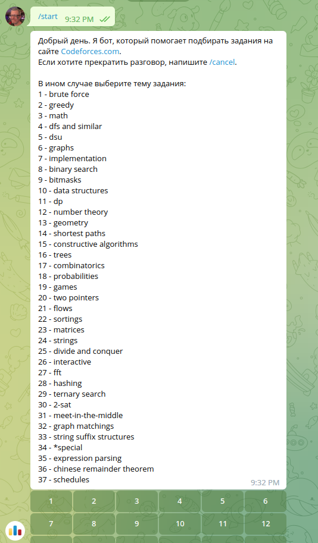
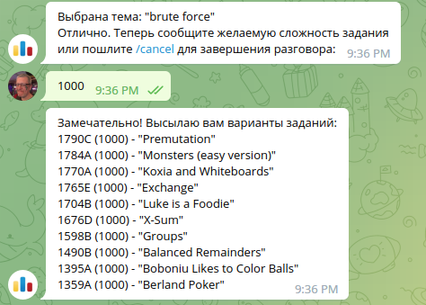

# Дипломная работа на тему «Подборка задач на сайте Codeforces»

## Описание

Проект представляет собой набор программ, которые позволяют:
1. На регулярной основе выкачивать с сайта **Codeforces** информации о задачах, которые
   были заданы на различных состязаниях по программированию. Задачи разбиты на различные
   категории по темам, сложности, а также у задач есть информация по количеству правильных решений.
1. Вносить скачанную информацию в БД для последующей обработки.
1. Разносить задачи по темам таким образом, чтобы каждая задача была отнесена только к одной
   теме, несмотря на то, что, как правило, задача относится к нескольким темам сразу.
1. Делать запрос задач по интересующей теме через **telegram**-бота. Также в запросе
   можно задавать требуемую сложность задач.

## Интерфейс

Интерфейс конечного пользователя оформлен в виде **telegram**-бота.
При подключении к боту и посылке команды `/start` пользователю высылается приветствие,
краткое описание функционала бота и предлагается выбрать тему интересующей задачи.
Выбора темы реализован с применением **Inline buttons**



После ввода темы у пользователя запрашивается требуемая сложность задачи.


После ввода сложности пользователю возвращается список задач (не более 10 штук),
которые соответствуют выбранной теме и наиболее приближены к запрашиваемой сложности:



Кроме того, для администратора системы предусмотрен веб интерфейс администратора.
Он позволяет:
1. Просматривать загруженные в БД задачи и темы, а так же их количество.
2. Запускать и останавливать периодическое сканирование сайта **Codeforces** на предмет обновления задач.
3. Запускать внеплановое сканирование задач.
4. Запускать внеплановое распределение задач по темам.

## Архитектура и используемый стек

Для реализации поставленной задачи было выбрано следующее решение:
1. Реляционная БД для хранения загруженной информации. Реляционная БД была выбрана потому,
   что характер хранимых данных соответствует сущностям разных типов со связями **"один ко многим"**
   и **"многие ко многим"**. В качестве конкретной СУБД была выбрана **PostgreSQL**.
2. Процедура создания БД и интерфейс администратора были реализованы с помощью фреймворка **Django**,
   как наиболее полно отвечающему требованиям задачи:
   - Создание БД и первоначальная миграция.
   - Создание веб-интерфейса.
   - Возможность запуска задач по расписанию.
  
1. Для запуска задач по расписанию используется пакет **django-crontab**.
   Выбор данного пакета обусловлен наличием требуемого функционала а так же хорошей
   документированностью и простостотой в использовании.

3. **telegram**-бот был реализован с помощью пакета **python-telegram-bot**.
   Данный пакет включает в себя все необходимые возможности:
   - Обработку команд.
   - Создание кнопок и обработку их нажатий.
   - Простота освоения и хорошая документация.
  
4. Доступ к БД из **telegram**-бота осуществляется с помощью пакета **SQLalchemy**,
   так как это требовалось в задании.

## Путеводитель по коду

Для хранения загруженных задач и тем в БД были разработаны следующие модели:

1. [Tag](https://github.com/fedor-metsger/codeforces/blob/b3ad149efed885f5cae6c8dad59caa72636987b9/problems/models.py#L6C7-L6C10) - модель для хранения тем.
2. [Problem](https://github.com/fedor-metsger/codeforces/blob/b3ad149efed885f5cae6c8dad59caa72636987b9/problems/models.py#L18) - модель для хранения задач.
3. [Belonging](https://github.com/fedor-metsger/codeforces/blob/b3ad149efed885f5cae6c8dad59caa72636987b9/problems/models.py#L34) - модель для связи задач и тем, к которым они отнесены.

Для скачивания задач с сайта **Codeforces** была создан модуль [scraper](https://github.com/fedor-metsger/codeforces/tree/main/scraper),
в котором есть функция [scrape_api](https://github.com/fedor-metsger/codeforces/blob/b3ad149efed885f5cae6c8dad59caa72636987b9/scraper/scraper.py#L93).
Данная функция позволяет выкачивать данные о задачах с сайта с использованием **Codeforces API**.

Для запуска задач по расписанию был создан модуль [crontab](https://github.com/fedor-metsger/codeforces/tree/main/crontab).
В модуле содержатся функции:
- [switch_crontab](https://github.com/fedor-metsger/codeforces/blob/b3ad149efed885f5cae6c8dad59caa72636987b9/crontab/manager.py#L15) -
позволяет запускать и останавливать периодический запуск задачи.
- [scan_codeforces](https://github.com/fedor-metsger/codeforces/blob/b3ad149efed885f5cae6c8dad59caa72636987b9/crontab/manager.py#L51) -
сканирует сайт **Codeforces** и обновляет список задач.
- [distrib](https://github.com/fedor-metsger/codeforces/blob/b3ad149efed885f5cae6c8dad59caa72636987b9/crontab/manager.py#L58) -
распределяет задачи по темам.
- [load_problems](https://github.com/fedor-metsger/codeforces/blob/b3ad149efed885f5cae6c8dad59caa72636987b9/crontab/manager.py#L93) -
запускается по расписанию для сканирования сайта и распределения задач по темам.

Также был создан модуль [bot](https://github.com/fedor-metsger/codeforces/tree/main/bot),
в котором реализован функционал **telegram**-бота.

## Результаты тестов

Для повышения стабильности кода были разработаны unit-тесты.

Команда запуска тестов: `coverage run --source='.' manage.py test`

Результат:
```
(venv) fedor@fedor-Z68P-DS3:~/CODE/SkyPro/codeforces$ coverage run --source='.' manage.py test
Found 3 test(s).
Creating test database for alias 'default'...
System check identified no issues (0 silenced).
...
----------------------------------------------------------------------
Ran 3 tests in 0.110s

OK
Destroying test database for alias 'default'...
(venv) fedor@fedor-Z68P-DS3:~/CODE/SkyPro/codeforces$
```

Команда вывода отчёта по покрытию тестами: `coverage report`
```
(venv) fedor@fedor-Z68P-DS3:~/CODE/SkyPro/codeforces$ coverage report
Name                                                                           Stmts   Miss  Cover
--------------------------------------------------------------------------------------------------
config/__init__.py                                                                 0      0   100%
config/asgi.py                                                                     4      4     0%
config/settings.py                                                                23      0   100%
config/urls.py                                                                     5      0   100%
config/wsgi.py                                                                     4      4     0%
crontab/__init__.py                                                                0      0   100%
crontab/manager.py                                                                65     19    71%
crontab/tests.py                                                                  45      0   100%
manage.py                                                                         12      2    83%
problems/__init__.py                                                               0      0   100%
problems/admin.py                                                                  8      0   100%
problems/apps.py                                                                   4      0   100%
problems/migrations/0001_initial.py                                                5      0   100%
problems/migrations/0002_alter_problem_number.py                                   4      0   100%
problems/migrations/0003_alter_tag_name.py                                         4      0   100%
problems/migrations/0004_alter_problem_difficulty_alter_problem_solutions.py       4      0   100%
problems/migrations/0005_belonging.py                                              5      0   100%
problems/migrations/__init__.py                                                    0      0   100%
problems/models.py                                                                27      3    89%
problems/tests.py                                                                  1      0   100%
problems/views.py                                                                 22      5    77%
scraper/__init__.py                                                                0      0   100%
scraper/scraper.py                                                                49     12    76%
scraper/tests.py                                                                  12      0   100%
--------------------------------------------------------------------------------------------------
TOTAL                                                                            303     49    84%
(venv) fedor@fedor-Z68P-DS3:~/CODE/SkyPro/codeforces$
```
